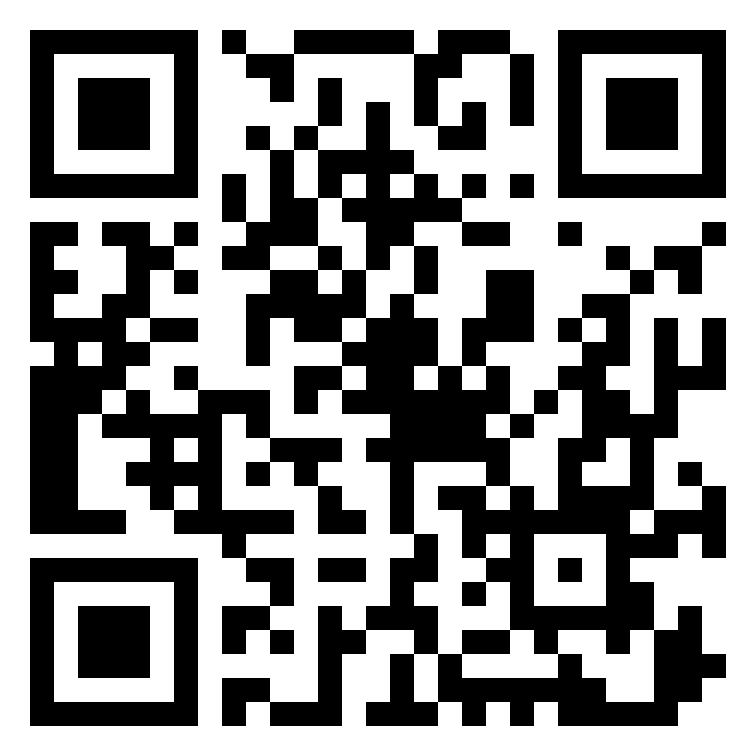

# BinaryGo
BinaryGo is an easy to use and very fast JSON-BINARY serializer/deserializer

Nuget:
https://www.nuget.org/packages/BinaryGo


```csharp
    public class UserInfo
    {
        public int Id { get; set; }
        public string Name { get; set; }
        public DateTime BirthDate { get; set; }
    }
    class Program
    {

        static void Main(string[] args)
        {
            UserInfo userInfo = new UserInfo()
            {
                Id = 1,
                BirthDate = DateTime.Now,
                Name = "ali"
            };
            var value = BinaryGo.Serializer.SingleIntance.Serialize(userInfo);
            Console.WriteLine(value);
            var deserialize = BinaryGo.Deserialize.Deserializer.SingleIntance.Deserialize<UserInfo>(value);
            Console.WriteLine(deserialize.Name);
            Console.ReadLine();
        }
    }
```

## Donate bitcoin to Ali-Yousefi:


My Public Address to Receive BTC bc1qkfq8xu2dteqj2fldlpyzhhnktq36yz4hfjmyc0

Pay me via Trust Wallet: https://link.trustwallet.com/send?coin=0&address=bc1qkfq8xu2dteqj2fldlpyzhhnktq36yz4hfjmyc0
